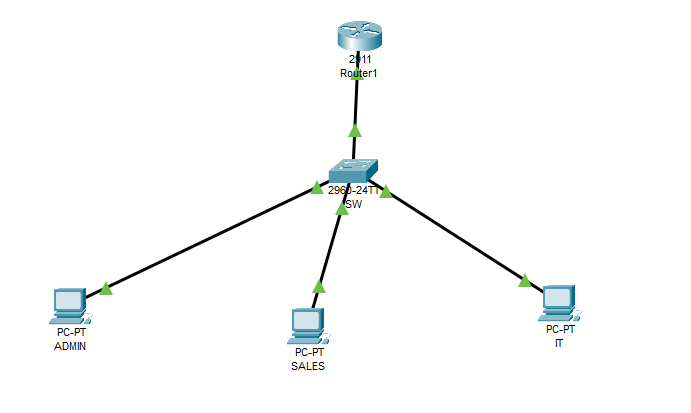
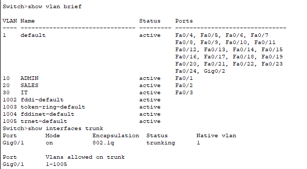

# 📂 README – VLAN_DHCP

## 📝 Description
Ce projet a pour but de configurer **3 VLANs sur un switch**, de permettre la **communication inter-VLAN** via **Router-on-a-Stick**, et de configurer **DHCP** pour chaque VLAN.
Toutes les configurations ont été testées avec succès dans **Packet Tracer**.

---

## 🏢 Topologie
- **Switch 2960**
- **Router**
- **3 PCs :**
- PC1 → VLAN10 (ADMIN)
- PC2 → VLAN20 (SALES)
- PC3 → VLAN30 (IT)
- **Trunk** entre switch et router
- **Ports access** pour les PCs
- ##✅ Vérifications
show vlan brief → VLANs actifs

show interfaces trunk → Trunk opérationnel

show ip route → Routes inter-VLAN présentes

show ip dhcp binding → IP distribuées aux PCs

Ping entre PC et gateway de chaque VLAN

Ping inter-VLAN entre tous les PCs

ip dhcp pool IT
network 192.168.30.0 255.255.255.0
default-router 192.168.30.1

##capture d'écran
### 1️⃣ Topologie réseau


### 2️⃣ Configuration VLAN


### 3️⃣ Configuration Routeur


## 💾 Fichiers inclus
- `VLAN+Router-on-a-Stick+DHCP.pkt` (Packet Tracer)


## 🔧 Configuration Switch
```bash
vlan 10
name ADMIN
vlan 20
name SALES
vlan 30
name IT

interface fa0/1
switchport mode access
switchport access vlan 10

interface fa0/2
switchport mode access
switchport access vlan 20

interface fa0/3
switchport mode access
switchport access vlan 30

interface g0/1
switchport mode trunk

## 🔧 Configuration Router – Router-on-a-Stick + DHCP
interface g0/0.10
encapsulation dot1Q 10
ip address 192.168.10.1 255.255.255.0
no shutdown

interface g0/0.20
encapsulation dot1Q 20
ip address 192.168.20.1 255.255.255.0
no shutdown

interface g0/0.30
encapsulation dot1Q 30
ip address 192.168.30.1 255.255.255.0
no shutdown

ip dhcp excluded-address 192.168.10.1
ip dhcp excluded-address 192.168.20.1
ip dhcp excluded-address 192.168.30.1

ip dhcp pool ADMIN
network 192.168.10.0 255.255.255.0
default-router 192.168.10.1

ip dhcp pool SALES
network 192.168.20.0 255.255.255.0
default-router 192.168.20.1

